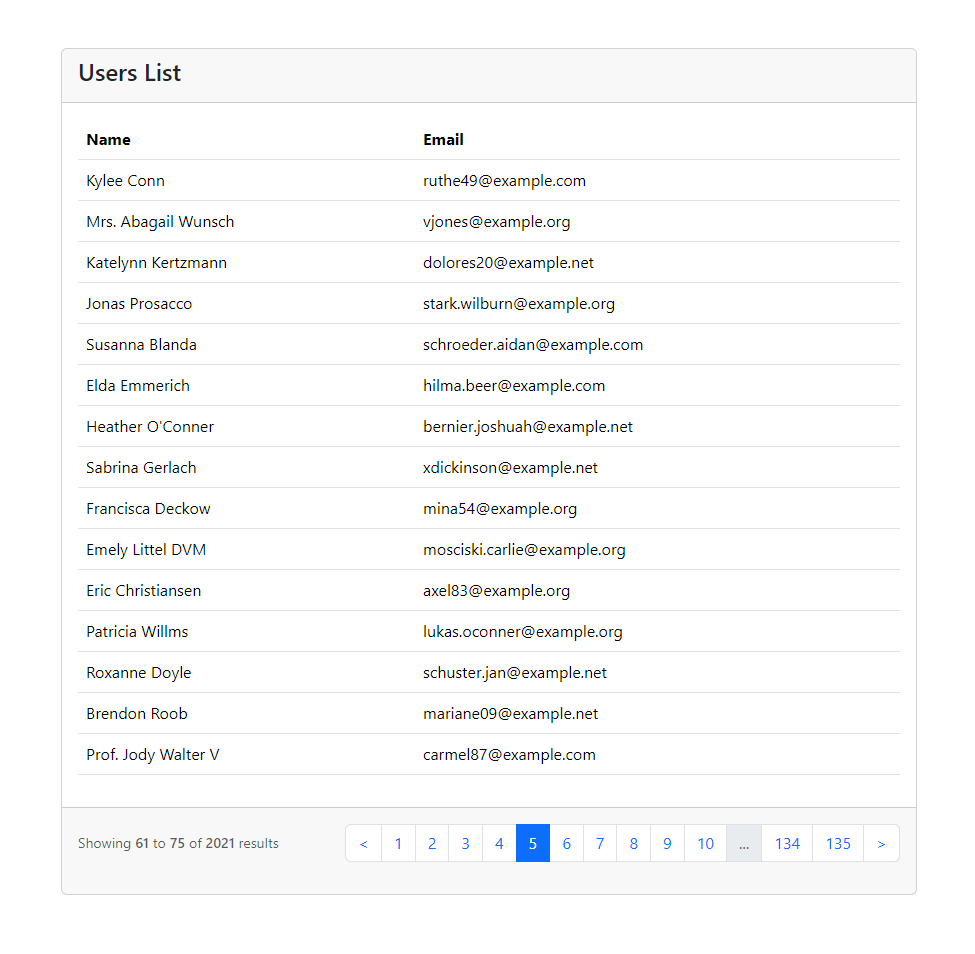

# React-Laravel Pagination

React-Laravel Pagination is a very simple pagination package for react components. This package is based on the Laravel pagination collection and bootstrap UI. This package helps to make pagination simple and efficient for React apps with a Laravel API.


# Installation
To install this package, simply run the following command with [npm](https://www.npmjs.com/):

```
$ npm install react-laravel-pagination
```

# Usage
Simply include the mandatory `data` and `onChangeHandler` props. Optional props further customize the pagination experience. Example code are below

```js
import { Pagination } from "react-laravel-pagination";
import { useEffect, useState } from "react";

function App() {
  const [users, setUsers] = useState();
  useEffect(() => {
    getUser();
  }, []);

  const getUser = (page = 1) => {
    const url = "you-url?page=" + page;
    fetch(url)
      .then((x) => x.text())
      .then((y) => {
        setUsers(JSON.parse(y));
      });
  };
  return (
    <div>
      {(users && Object.keys(users).length > 0 )&& (
        <Pagination data={users} onChangeHandler={getUser} />
      )}
    </div>
  );
}

export default App;
```

# Props for Pagination Component
Customize your pagination experience by utilizing a range of props that suit your requirements and enhance functionality.

| Prop Name              | Type                    | Description                                           | Default/Required                         |
|------------------------|-------------------------|-------------------------------------------------------|------------------------------------------|
| data                   | `object`                | Object containing pagination data properties.         |              `required`                  |
| data.from              | `string` or `number`    | The starting item number of the current page.         |              `required`                  |
| data.to                | `string` or `number`    | The ending item number of the current page.           |              `required`                  |
| data.total             | `string` or `number`    | The total number of items.                            |              `required`                  |
| data.links             | `array`                 | Array of links for pagination.                        |              `required`                  |
| onChangeHandler        | `func`                  | Handler function for page change.                     |              `required`                  |
| previousBtnText        | `string` or `element`   | Text or element for the previous button.              |                 `<`                      |
| nextBtnText            | `string` or `element`   | Text or element for the next button.                  |                  `>`                     |   
| showingCount           | `bool`                  | Whether to display the item count.                    |                `true`                    |
| activePage             | `number`                | Active|Current page number.                           |    `1 or url page query string value`    |
| paginationClass        | `string`                | CSS class for the pagination container.               | `"pagination flex-wrap gap-2 gap-md-0"`  |
| paginateItemClass      | `string`                | CSS class for each pagination item.                   |              `"page-item"`               |
| paginateLinkClass      | `string`                | CSS class for pagination links.                       |        `"page-link cursor-pointer"`      |
| pageNumberAppendToUrl  | `bool`                  | Whether to append the page number to the URL.         |                `true`                    |         


# use `usePaginationParams` Hook
A React hook for managing page numbers from URL query parameters. It maintains the page number in the URL across reloads and facilitates fetching data from a server based on the specified page number.

```js
import { usePaginationParams } from "react-laravel-pagination";

function App() {
  const { pageNumber } = usePaginationParams();
  useEffect(() => {
    getUser();
  }, []);

  const getUser = (page = pageNumber) => {
    const url = "you-url?page=" + page;
    fetch(url)
      .then((x) => x.text())
      .then((y) => {
        setUsers(JSON.parse(y));
      });
  };
  return (
    <div>
      {(users && Object.keys(users).length > 0 )&& (
        <Pagination data={users} onChangeHandler={getUser} />
      )}
    </div>
  );
}

export default App;

```

# Demo
Here is a screenshot demonstrating the final or result of using pagination package.



# License
React-Laravel Pagination is created by [Fahim Muntasir](https://github.com/fahim27)  . Released under the MIT license.